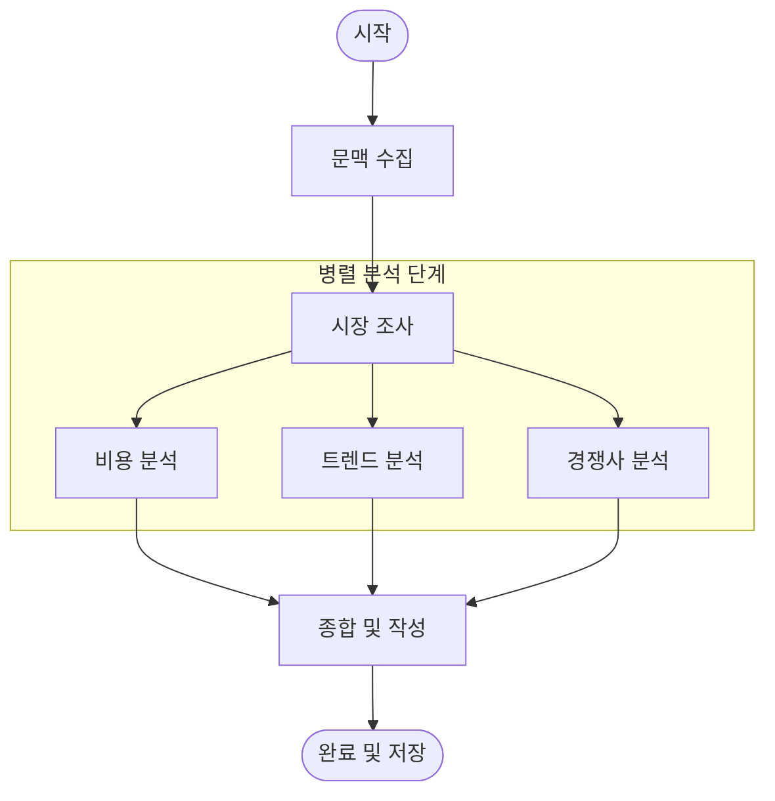

# 마케팅 리포트 생성 워크플로우 (LangGraph)

## 1. 개요 (Overview)

이 문서는 디자인 패키지의 핵심 구성 요소인 **마케팅 리포트(Marketing Report)**를 생성하기 위한 비동기 LangGraph 워크플로우를 정의합니다.
Mercury V2는 UX 최적화를 위해 **"Draft-First (선생성 후완성)" 전략**을 채택했습니다.

1.  **동기 처리 (Sync)**: API 요청 즉시 "기본 패키지(Basic Package)"(이미지+메타데이터)를 생성하고 `partial` 상태로 반환합니다.
2.  **비동기 처리 (Async)**: 이 워크플로우가 백그라운드에서 실행되어 시장을 분석하고, 리포트 데이터를 채워 넣습니다.

## 2. 그래프 아키텍처 (Graph Architecture)

LangGraph를 사용하여 상태를 관리하는 멀티 스텝 분석 프로세스를 구현합니다.



## 3. 상태 스키마 (State Schema)

노드 간에 공유되는 데이터 구조(`GraphState`)입니다.

```python
class GraphState(TypedDict):
    # Inputs (입력 데이터)
    package_id: str
    brand_context: dict  # { name, identity, target_audience }
    design_context: dict # { prompt, image_captions, style_tags }
    
    # Internal Analysis Data (분석 중간 데이터)
    search_results: list[dict] # 검색 API 결과
    market_metrics: dict       # 시장 규모, 성장률 등
    cost_estimation: dict      # 예상 원가, 권장 가격
    competitor_data: list[dict]# 경쟁사 목록 및 스펙
    
    # Output (최종 결과)
    final_report: dict  # DB에 저장될 구조화된 리포트 JSON
    errors: list[str]   # 에러 로그
```

## 4. 워크플로우 노드 상세 (Workflow Nodes)

### 4.1 문맥 수집 (Collect Context)
- **입력**: `package_id`
- **동작**: DB에서 Design Package, Chat Session, Canvas Project 데이터를 조회합니다.
- **출력**: State의 `brand_context`와 `design_context`를 채웁니다.

### 4.2 시장 조사 (Market Research)
- **동작**: LLM을 사용해 디자인 문맥에 맞는 검색 쿼리를 생성하고, 외부 검색 API(Tavily, Bing 등)를 호출합니다.
- **목표**: 유사 제품, 현재 트렌드, 타겟 시장에 대한 실시간 데이터를 수집합니다.

### 4.3 비용 분석 (Cost Analysis)
- **동작**: `image_captions`와 메타데이터에서 재질, 공정 복잡도를 분석합니다.
- **로직**: 신발 종류와 소재에 따른 표준 제조 원가 테이블을 기반으로 LLM이 추산합니다.

### 4.4 트렌드 및 경쟁사 분석 (Trend & Competitor Analysis)
- **동작**: 수집된 시장 데이터와 내 디자인을 비교 분석합니다.
- **목표**: "이 디자인이 왜 지금 통하는가(Trend Fit)"와 "누구와 경쟁해야 하는가(Competitors)"를 도출합니다.

### 4.5 종합 및 작성 (Synthesis)
- **동작**: 각 분석 노드의 결과를 취합하여 최종 리포트 포맷(JSON)으로 정리합니다.
- **LLM 역할**: 전문 에디터 페르소나를 가지고 어조(Tone & Manner)를 통일하고, 차트용 데이터를 생성합니다.

### 4.6 리포트 완료 (Finalize Report)
- **동작**: 
    1. `design_packages` 테이블 업데이트:
       - `market_report` 컬럼에 `final_report` 저장.
       - `status`를 `completed`로 업데이트.
    2. SSE 알림 발송: `event: package_completed`.

## 5. 통합 전략 (Integration Strategy)

- **트리거**: `POST /design-packages` API 호출 시 Celery Task가 트리거됩니다.
- **실행**: Celery Worker가 컴파일된 LangGraph 워크플로우를 실행합니다(`app.invoke(input)`).
- **타임아웃**: 비동기 작업이므로 긴 검색 시간(최대 5~10분)을 허용하지만, 목표 실행 시간은 60초 이내입니다.

## 6. 모니터링 및 트레이싱 (LangSmith)

복잡한 LangGraph 워크플로우의 실행 과정을 시각화하고 디버깅하기 위해 **LangSmith**를 사용합니다. 별도의 API 개발 없이 환경 변수 설정만으로 연동됩니다.

### 6.1 설정 (Environment Variables)
백엔드 서버(`mercury_v2_backend`)의 `.env` 파일에 다음 설정을 추가합니다.

```ini
# LangSmith Tracing
LANGCHAIN_TRACING_V2=true
LANGCHAIN_ENDPOINT="https://api.smith.langchain.com"
LANGCHAIN_API_KEY="<YOUR_LANGSMITH_API_KEY>"
LANGCHAIN_PROJECT="mercury-v2-production"
```

### 6.2 주요 기능 및 이점
1.  **실시간 트레이싱 (Tracing)**:
    - LangSmith 대시보드에서 각 노드(시장 조사, 비용 분석 등)의 입력/출력, 실행 시간, LLM 사용량(토큰)을 실시간으로 확인할 수 있습니다.
2.  **디버깅 (Debugging)**:
    - 리포트 생성 실패 시, 어느 노드에서 어떤 입력값 때문에 에러가 발생했는지 즉시 파악 가능합니다.
3.  **데이터셋 구축 (Datasets)**:
    - 성공적으로 생성된 리포트 데이터를 저장하여, 추후 LLM 파인튜닝이나 프롬프트 개선을 위한 테스트 데이터셋으로 활용할 수 있습니다.
