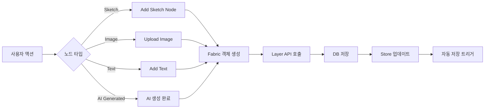

# Canvas Interaction Flow

**문서 정보**:
- **작성일**: 2026-01-25
- **목적**: Canvas 노드 기반 워크플로우의 상세 구현 가이드
- **대상**: Frontend 개발자
- **관련 문서**:
  - [REQ-003: Sketch to Design](file:///c:/Users/tjwn1/Desktop/mercury_v2_proto/docs/requirements/req-003-sketch-to-design.md)
  - [UI Spec: Canvas](file:///c:/Users/tjwn1/Desktop/mercury_v2_proto/docs/design-fe/ui-spec-canvas.md)
  - [API Spec: Canvas](file:///c:/Users/tjwn1/Desktop/mercury_v2_proto/docs/design-be/api-spec-canvas.md)
  - [DB Schema](file:///c:/Users/tjwn1/Desktop/mercury_v2_proto/docs/design-be/schema.md)

---

## 1. 노드 생명주기 (Node Lifecycle)

### 1.1 생성 (Creation)



#### Sketch 노드 생성
```typescript
const createSketchNode = async () => {
  // 1. 노드 수 체크
  if (layers.length >= 20) {
    showMaxNodesWarning();
    return;
  }

  // 2. Fabric 객체 생성
  const sketchFrame = new fabric.Rect({
    left: canvasCenter.x - 384,
    top: canvasCenter.y - 384,
    width: 768,
    height: 768,
    fill: 'white',
    stroke: '#d1d5db',
    strokeWidth: 1,
    strokeDashArray: [5, 5],
    selectable: true,
  });

  // 3. 캔버스에 추가
  fabricCanvas.add(sketchFrame);
  fabricCanvas.setActiveObject(sketchFrame);

  // 4. API 호출
  const layer = await api.createLayer(canvasId, {
    layer_type: 'sketch',
    layer_data: {
      paths: [],
      x: sketchFrame.left,
      y: sketchFrame.top,
      width: 768,
      height: 768,
      fabric_json: sketchFrame.toJSON(),
    },
    z_index: layers.length + 1,
  });

  // 5. Fabric 객체에 레이어 ID 매핑
  sketchFrame.layerId = layer.id;
  sketchFrame.layerType = 'sketch';

  // 6. Store 업데이트
  addLayer(layer);

  // 7. 자동 저장 트리거
  triggerAutoSave();
};
```

#### Image 노드 생성 (AI 생성)
```typescript
const placeGeneratedImage = (parentNode: CanvasNode, imageUrl: string, metadata: any) => {
  // 1. 부모 노드 오른쪽 50px 위치 계산
  const position = {
    x: parentNode.x + parentNode.width + 50,
    y: parentNode.y,
  };

  // 2. Fabric Image 객체 생성
  fabric.Image.fromURL(imageUrl, (img) => {
    img.set({
      left: position.x,
      top: position.y,
      scaleX: 768 / img.width,
      scaleY: 768 / img.height,
    });

    // 3. 캔버스에 추가
    fabricCanvas.add(img);

    // 4. API 호출
    api.createLayer(canvasId, {
      layer_type: 'image',
      layer_data: {
        image_url: imageUrl,
        source: 'ai_generated',
        x: position.x,
        y: position.y,
        width: 768,
        height: 768,
        parent_layer_id: parentNode.layerId,
        prompt: metadata.prompt,
        generation_params: metadata.params,
        reference_layer_ids: metadata.references,
        fabric_json: img.toJSON(),
      },
      z_index: layers.length + 1,
    }).then((layer) => {
      img.layerId = layer.id;
      img.layerType = 'image';
      addLayer(layer);
      
      // 5. 연결선 생성
      createConnectionLine(parentNode.layerId, layer.id);
    });
  });
};
```

### 1.2 편집 (Editing)

```typescript
// Fabric 이벤트 리스너
fabricCanvas.on('object:modified', (e) => {
  const obj = e.target;
  
  // 1. 레이어 데이터 업데이트
  const updatedData = {
    layer_data: {
      ...obj.layerData,
      x: obj.left,
      y: obj.top,
      rotation: obj.angle,
      scale_x: obj.scaleX,
      scale_y: obj.scaleY,
      fabric_json: obj.toJSON(),
    },
  };

  // 2. API 호출 (Debounced)
  debouncedUpdateLayer(obj.layerId, updatedData);
});
```

### 1.3 삭제 (Deletion)

```typescript
const deleteNode = async (layerId: string) => {
  // 1. Fabric 객체 찾기
  const obj = fabricCanvas.getObjects().find(o => o.layerId === layerId);
  
  // 2. 연결선 삭제
  deleteConnectionLines(layerId);
  
  // 3. Fabric에서 제거
  if (obj) {
    fabricCanvas.remove(obj);
  }

  // 4. API 호출
  await api.deleteLayer(canvasId, layerId);

  // 5. Store 업데이트
  removeLayer(layerId);
};
```

---

## 2. 상태 관리 아키텍처 (State Management)

### 2.1 Zustand Store 구조

```typescript
interface CanvasStore {
  // Canvas 기본 정보
  canvasId: string | null;
  canvasName: string;
  
  // 노드 (레이어) 관리
  layers: CanvasLayer[];
  selectedLayerId: string | null;
  
  // 도구 상태
  activeTool: ToolType;
  brushSettings: BrushSettings;
  
  // Undo/Redo (프론트엔드 메모리)
  history: string[]; // Fabric JSON strings
  historyIndex: number;
  
  // 저장 상태
  savingState: 'idle' | 'saving' | 'saved' | 'error';
  
  // Segmentation 캐시
  segmentationCache: Map<string, Segments>;
  
  // 연결선 표시 여부
  showConnections: boolean;
  
  // Actions
  setActiveTool: (tool: ToolType) => void;
  addLayer: (layer: CanvasLayer) => void;
  updateLayer: (id: string, data: Partial<CanvasLayer>) => void;
  removeLayer: (id: string) => void;
  setSelectedLayerId: (id: string | null) => void;
  pushHistory: (state: string) => void;
  undo: () => string | null;
  redo: () => string | null;
  setSavingState: (state: SavingState) => void;
  setSegmentation: (layerId: string, segments: Segments) => void;
  toggleConnections: () => void;
}
```

### 2.2 Fabric.js ↔ Store 동기화

```typescript
// Fabric → Store (단방향)
fabricCanvas.on('selection:created', (e) => {
  const obj = e.selected?.[0];
  if (obj?.layerId) {
    setSelectedLayerId(obj.layerId);
  }
});

fabricCanvas.on('object:added', () => {
  pushHistory(fabricCanvas.toJSON());
});

// Store → Fabric (Undo/Redo 시)
const handleUndo = () => {
  const prevState = undo();
  if (prevState) {
    fabricCanvas.loadFromJSON(prevState, () => {
      fabricCanvas.renderAll();
    });
  }
};
```

### 2.3 자동 저장 로직

```typescript
const useAutoSave = (canvasId: string) => {
  const saveTimeoutRef = useRef<number | null>(null);
  const { setSavingState, pushHistory } = useCanvasStore();
  const { mutate: updateProject } = useUpdateCanvasProject();

  const triggerAutoSave = useCallback(() => {
    if (!canvasId || !fabricCanvasRef.current) return;

    // 기존 타이머 취소
    if (saveTimeoutRef.current) {
      clearTimeout(saveTimeoutRef.current);
    }

    setSavingState('saving');

    // 2초 Debounce
    saveTimeoutRef.current = setTimeout(() => {
      const canvas = fabricCanvasRef.current;
      if (!canvas) return;

      // 히스토리 저장 (프론트엔드)
      const canvasJson = JSON.stringify(canvas.toJSON());
      pushHistory(canvasJson);

      // 서버 저장 (뷰포트 정보만)
      updateProject(
        {
          canvasId,
          data: {
            canvas_state: {
              viewport: {
                x: 0,
                y: 0,
                zoom: canvas.getZoom(),
              },
            },
          },
        },
        {
          onSuccess: () => setSavingState('saved'),
          onError: () => setSavingState('error'),
        }
      );
    }, 2000);
  }, [canvasId, pushHistory, updateProject, setSavingState]);

  return { triggerAutoSave };
};
```

---

## 3. AI 프롬프팅 플로우

### 3.1 Add Reference 기능

```typescript
const AIPromptPanel = ({ canvasId, selectedLayerId }) => {
  const [references, setReferences] = useState<string[]>([]);
  const [isAddingReference, setIsAddingReference] = useState(false);

  const handleAddReference = () => {
    setIsAddingReference(true);
    
    // 캔버스 커서 변경
    fabricCanvas.defaultCursor = 'crosshair';
    
    // 클릭 이벤트 리스너
    const handleClick = (e: fabric.IEvent) => {
      const obj = e.target;
      
      if (obj?.layerId && obj.layerId !== selectedLayerId) {
        // 최대 5개 제한
        if (references.length < 5) {
          setReferences([...references, obj.layerId]);
        }
      }
      
      // 리스너 제거
      fabricCanvas.off('mouse:down', handleClick);
      fabricCanvas.defaultCursor = 'default';
      setIsAddingReference(false);
    };
    
    fabricCanvas.on('mouse:down', handleClick);
  };

  const handleGenerate = async () => {
    const selectedLayer = layers.find(l => l.id === selectedLayerId);
    
    const response = await api.generateImage(canvasId, {
      layer_ids: [selectedLayerId, ...references],
      prompt: promptValue,
      generation_params: {
        strength: 0.7,
        steps: 50,
        guidance_scale: 7.5,
      },
    });

    // Polling 시작
    pollTaskStatus(response.task_id);
  };

  return (
    <div>
      <textarea value={promptValue} onChange={...} />
      
      <div>
        <h4>References ({references.length}/5)</h4>
        {references.map(refId => (
          <ReferenceThumbnail key={refId} layerId={refId} onRemove={...} />
        ))}
        <button onClick={handleAddReference}>+ Add Reference</button>
      </div>
      
      <button onClick={handleGenerate}>Generate</button>
    </div>
  );
};
```

### 3.2 Polling 및 결과 처리

```typescript
const pollTaskStatus = async (taskId: string) => {
  const interval = setInterval(async () => {
    const status = await api.getTaskStatus(taskId);

    if (status.status === 'SUCCESS') {
      clearInterval(interval);
      
      // 결과 이미지를 노드로 추가
      const parentLayer = layers.find(l => l.id === selectedLayerId);
      placeGeneratedImage(parentLayer, status.result.image_url, {
        prompt: promptValue,
        params: generationParams,
        references: references,
      });
    } else if (status.status === 'FAILURE') {
      clearInterval(interval);
      showError(status.error.message);
    }
  }, 3000); // 3초 간격
};
```

---

## 4. Segmentation 캐싱 전략

### 4.1 메모리 캐싱

```typescript
const useSegmentation = (canvasId: string) => {
  const { segmentationCache, setSegmentation } = useCanvasStore();

  const requestSegmentation = async (layerId: string) => {
    // 1. 캐시 확인
    if (segmentationCache.has(layerId)) {
      return segmentationCache.get(layerId);
    }

    // 2. API 호출
    const result = await api.segmentImage(canvasId, { layer_id: layerId });

    // 3. 캐시 저장
    setSegmentation(layerId, result.segments);

    return result.segments;
  };

  const invalidateCache = (layerId: string) => {
    segmentationCache.delete(layerId);
  };

  return { requestSegmentation, invalidateCache };
};
```

### 4.2 캐시 무효화 조건

```typescript
// 이미지 수정 시 캐시 무효화
fabricCanvas.on('object:modified', (e) => {
  const obj = e.target;
  
  if (obj.layerType === 'image' && obj.layerId) {
    invalidateCache(obj.layerId);
  }
});

// Inpainting 완료 시 캐시 무효화
const handleInpaintingComplete = (layerId: string) => {
  invalidateCache(layerId);
};
```

---

## 5. 연결선 렌더링 로직

### 5.1 연결선 생성

```typescript
const createConnectionLine = (parentId: string, childId: string) => {
  const parentObj = fabricCanvas.getObjects().find(o => o.layerId === parentId);
  const childObj = fabricCanvas.getObjects().find(o => o.layerId === childId);

  if (!parentObj || !childObj) return;

  // 베지어 곡선 계산
  const startX = parentObj.left + parentObj.width;
  const startY = parentObj.top + parentObj.height / 2;
  const endX = childObj.left;
  const endY = childObj.top + childObj.height / 2;

  const controlX1 = startX + (endX - startX) / 3;
  const controlX2 = startX + (endX - startX) * 2 / 3;

  const pathData = `M ${startX} ${startY} C ${controlX1} ${startY}, ${controlX2} ${endY}, ${endX} ${endY}`;

  const line = new fabric.Path(pathData, {
    stroke: '#9ca3af',
    strokeWidth: 1,
    strokeDashArray: [5, 5],
    fill: '',
    selectable: false,
    evented: false,
  });

  // 메타데이터 저장
  line.connectionId = `${parentId}-${childId}`;
  line.parentId = parentId;
  line.childId = childId;

  // Z-index 조정 (노드 아래)
  fabricCanvas.insertAt(line, 0);
  fabricCanvas.renderAll();

  return line;
};
```

### 5.2 연결선 업데이트

```typescript
// 노드 이동 시 연결선 업데이트
fabricCanvas.on('object:moving', (e) => {
  const obj = e.target;
  
  if (!obj.layerId) return;

  // 이 노드와 연결된 모든 연결선 찾기
  const connections = fabricCanvas.getObjects().filter(o => 
    o.connectionId && (o.parentId === obj.layerId || o.childId === obj.layerId)
  );

  connections.forEach(line => {
    const parentObj = fabricCanvas.getObjects().find(o => o.layerId === line.parentId);
    const childObj = fabricCanvas.getObjects().find(o => o.layerId === line.childId);

    if (parentObj && childObj) {
      // 경로 재계산
      const startX = parentObj.left + parentObj.width;
      const startY = parentObj.top + parentObj.height / 2;
      const endX = childObj.left;
      const endY = childObj.top + childObj.height / 2;

      const controlX1 = startX + (endX - startX) / 3;
      const controlX2 = startX + (endX - startX) * 2 / 3;

      line.path = [
        ['M', startX, startY],
        ['C', controlX1, startY, controlX2, endY, endX, endY],
      ];
    }
  });

  fabricCanvas.renderAll();
});
```

### 5.3 연결선 토글

```typescript
const toggleConnections = () => {
  const { showConnections, toggleConnections: toggle } = useCanvasStore();
  
  toggle();

  // 모든 연결선 표시/숨김
  fabricCanvas.getObjects().forEach(obj => {
    if (obj.connectionId) {
      obj.visible = !showConnections;
    }
  });

  fabricCanvas.renderAll();
};
```

---

## 6. 성능 최적화

### 6.1 대량 노드 렌더링

```typescript
// 레이어 로드 시 배치 처리
const loadLayers = async (layers: CanvasLayer[]) => {
  fabricCanvas.renderOnAddRemove = false; // 렌더링 일시 중지

  for (const layer of layers) {
    const obj = await layerToFabricObject(layer);
    fabricCanvas.add(obj);
  }

  fabricCanvas.renderOnAddRemove = true;
  fabricCanvas.renderAll(); // 한 번만 렌더링
};
```

### 6.2 연결선 렌더링 최적화

```typescript
// 뷰포트 밖 연결선은 렌더링 스킵
const isInViewport = (line: fabric.Path) => {
  const vpt = fabricCanvas.viewportTransform;
  const zoom = fabricCanvas.getZoom();
  
  // 간단한 바운딩 박스 체크
  // 실제 구현 시 더 정교한 로직 필요
  return true; // 일단 모두 렌더링
};
```

---

## 7. 에러 처리

### 7.1 노드 생성 실패

```typescript
const handleCreateNodeError = (error: any) => {
  if (error.code === 'MAX_LAYERS_EXCEEDED') {
    showToast({
      type: 'error',
      message: '캔버스당 최대 20개 노드까지 생성할 수 있습니다.',
    });
  } else {
    showToast({
      type: 'error',
      message: '노드 생성에 실패했습니다. 다시 시도해주세요.',
    });
  }
};
```

### 7.2 AI 생성 실패

```typescript
const handleGenerationError = (error: any) => {
  showToast({
    type: 'error',
    message: `이미지 생성 실패: ${error.message}`,
    action: {
      label: '재시도',
      onClick: () => retryGeneration(),
    },
  });
};
```

---

## 8. 구현 체크리스트

- [ ] Zustand Store 구조 구현
- [ ] Fabric.js 초기화 및 이벤트 리스너
- [ ] 노드 생성 UI (Add Sketch Node, Upload Image, Add Text)
- [ ] 노드 타입별 Fabric 객체 생성
- [ ] 자동 저장 (2초 Debounce)
- [ ] Undo/Redo (프론트엔드 메모리)
- [ ] AI Prompt Panel
- [ ] Add Reference 기능
- [ ] Polling 및 결과 처리
- [ ] 연결선 렌더링
- [ ] 연결선 토글
- [ ] Segmentation 캐싱
- [ ] 노드 최대 제한 (20개) 경고
- [ ] 에러 처리
- [ ] 성능 최적화

---

**작성자**: Product Owner  
**검토자**: Frontend Developer  
**최종 업데이트**: 2026-01-25
