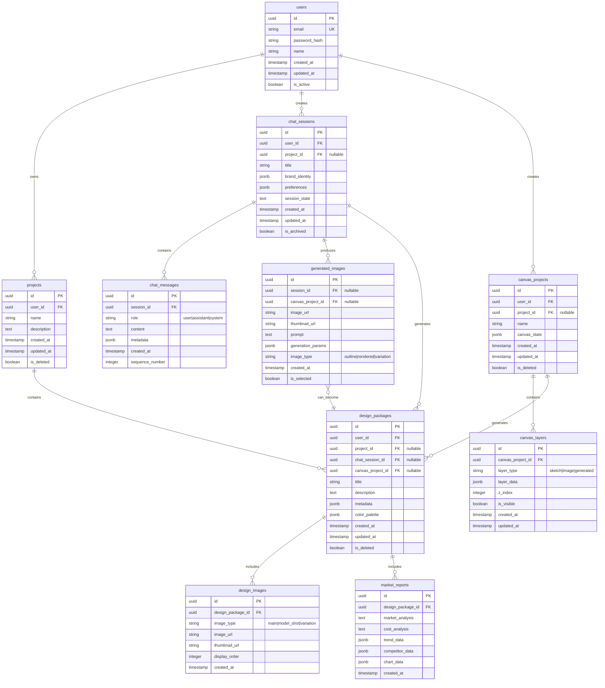

# Database Schema Design

## 1. 개요

Mercury V2는 신발 디자이너를 위한 생성형 AI 서비스로, 사용자 인증, 프로젝트 관리, AI 채팅 세션, 캔버스 작업, 디자인 패키지 생성 및 갤러리 기능을 제공합니다.

**기술 스택**: PostgreSQL, SQLAlchemy (Async)

---

## 2. ERD (Entity Relationship Diagram)

---

## 3. 테이블 상세 설계

### 3.1 users (사용자)

MVP 단계에서는 단일 사용자 환경을 가정하지만, 확장성을 고려하여 설계합니다.

| Column | Type | Constraints | Description |
|--------|------|-------------|-------------|
| id | UUID | PK | 사용자 고유 ID |
| email | VARCHAR(255) | UNIQUE, NOT NULL | 이메일 (로그인 ID) |
| password_hash | VARCHAR(255) | NOT NULL | 암호화된 비밀번호 |
| name | VARCHAR(100) | NOT NULL | 사용자 이름 |
| created_at | TIMESTAMP | NOT NULL, DEFAULT NOW() | 생성 일시 |
| updated_at | TIMESTAMP | NOT NULL, DEFAULT NOW() | 수정 일시 |
| is_active | BOOLEAN | NOT NULL, DEFAULT TRUE | 활성 상태 |

**인덱스**:
- `idx_users_email` on `email`

---

### 3.2 projects (프로젝트)

관련된 디자인 작업들의 묶음 폴더 개념입니다.

| Column | Type | Constraints | Description |
|--------|------|-------------|-------------|
| id | UUID | PK | 프로젝트 고유 ID |
| user_id | UUID | FK → users(id), NOT NULL | 소유자 |
| name | VARCHAR(200) | NOT NULL | 프로젝트 이름 |
| description | TEXT | NULL | 프로젝트 설명 |
| created_at | TIMESTAMP | NOT NULL, DEFAULT NOW() | 생성 일시 |
| updated_at | TIMESTAMP | NOT NULL, DEFAULT NOW() | 수정 일시 |
| is_deleted | BOOLEAN | NOT NULL, DEFAULT FALSE | 소프트 삭제 플래그 |

**인덱스**:
- `idx_projects_user_id` on `user_id`
- `idx_projects_created_at` on `created_at DESC`

---

### 3.3 chat_sessions (채팅 세션)

텍스트 기반 디자인 생성 대화 세션입니다.

| Column | Type | Constraints | Description |
|--------|------|-------------|-------------|
| id | UUID | PK | 세션 고유 ID |
| user_id | UUID | FK → users(id), NOT NULL | 세션 소유자 |
| project_id | UUID | FK → projects(id), NULL | 연결된 프로젝트 (Optional) |
| title | VARCHAR(200) | NOT NULL | 세션 제목 (자동 생성 또는 사용자 지정) |
| brand_identity | JSONB | NULL | 브랜드 아이덴티티 정보 |
| preferences | JSONB | NULL | 사용자 선호도 (타겟, 소재, 색상, 가격대 등) |
| session_state | TEXT | NULL | 현재 세션 상태 (interview/outline_selection/generation/finalized) |
| created_at | TIMESTAMP | NOT NULL, DEFAULT NOW() | 생성 일시 |
| updated_at | TIMESTAMP | NOT NULL, DEFAULT NOW() | 수정 일시 |
| is_archived | BOOLEAN | NOT NULL, DEFAULT FALSE | 아카이브 여부 |

**인덱스**:
- `idx_chat_sessions_user_id` on `user_id`
- `idx_chat_sessions_project_id` on `project_id`
- `idx_chat_sessions_created_at` on `created_at DESC`

---

### 3.4 chat_messages (채팅 메시지)

채팅 세션 내의 개별 메시지입니다.

| Column | Type | Constraints | Description |
|--------|------|-------------|-------------|
| id | UUID | PK | 메시지 고유 ID |
| session_id | UUID | FK → chat_sessions(id), NOT NULL | 세션 ID |
| role | VARCHAR(20) | NOT NULL | 메시지 역할 (user/assistant/system) |
| content | TEXT | NOT NULL | 메시지 내용 |
| metadata | JSONB | NULL | 추가 메타데이터 (이미지 참조 등) |
| created_at | TIMESTAMP | NOT NULL, DEFAULT NOW() | 생성 일시 |
| sequence_number | INTEGER | NOT NULL | 메시지 순서 |

**인덱스**:
- `idx_chat_messages_session_id` on `session_id`
- `idx_chat_messages_sequence` on `(session_id, sequence_number)`

---

### 3.5 generated_images (생성된 이미지)

AI가 생성한 모든 이미지를 기록합니다.

| Column | Type | Constraints | Description |
|--------|------|-------------|-------------|
| id | UUID | PK | 이미지 고유 ID |
| session_id | UUID | FK → chat_sessions(id), NULL | 채팅 세션 ID (채팅에서 생성된 경우) |
| canvas_project_id | UUID | FK → canvas_projects(id), NULL | 캔버스 프로젝트 ID (캔버스에서 생성된 경우) |
| image_url | VARCHAR(500) | NOT NULL | 원본 이미지 URL |
| thumbnail_url | VARCHAR(500) | NULL | 썸네일 이미지 URL |
| prompt | TEXT | NOT NULL | 생성에 사용된 프롬프트 |
| generation_params | JSONB | NULL | 생성 파라미터 (model, strength, seed 등) |
| image_type | VARCHAR(50) | NOT NULL | 이미지 타입 (outline/rendered/variation) |
| created_at | TIMESTAMP | NOT NULL, DEFAULT NOW() | 생성 일시 |
| is_selected | BOOLEAN | NOT NULL, DEFAULT FALSE | 사용자 선택 여부 |

**인덱스**:
- `idx_generated_images_session_id` on `session_id`
- `idx_generated_images_canvas_project_id` on `canvas_project_id`
- `idx_generated_images_created_at` on `created_at DESC`

---

### 3.6 canvas_projects (캔버스 프로젝트)

스케치 기반 디자인 작업 프로젝트입니다.

| Column | Type | Constraints | Description |
|--------|------|-------------|-------------|
| id | UUID | PK | 캔버스 프로젝트 고유 ID |
| user_id | UUID | FK → users(id), NOT NULL | 소유자 |
| project_id | UUID | FK → projects(id), NULL | 연결된 프로젝트 (Optional) |
| name | VARCHAR(200) | NOT NULL | 캔버스 이름 |
| canvas_state | JSONB | NULL | 캔버스 전체 상태 (viewport, zoom 등) |
| created_at | TIMESTAMP | NOT NULL, DEFAULT NOW() | 생성 일시 |
| updated_at | TIMESTAMP | NOT NULL, DEFAULT NOW() | 수정 일시 |
| is_deleted | BOOLEAN | NOT NULL, DEFAULT FALSE | 소프트 삭제 플래그 |

**인덱스**:
- `idx_canvas_projects_user_id` on `user_id`
- `idx_canvas_projects_project_id` on `project_id`

---

### 3.7 canvas_layers (캔버스 레이어)

캔버스 내의 개별 레이어입니다.

| Column | Type | Constraints | Description |
|--------|------|-------------|-------------|
| id | UUID | PK | 레이어 고유 ID |
| canvas_project_id | UUID | FK → canvas_projects(id), NOT NULL | 캔버스 프로젝트 ID |
| layer_type | VARCHAR(50) | NOT NULL | 레이어 타입 (sketch/image/generated) |
| layer_data | JSONB | NOT NULL | 레이어 데이터 (좌표, 스타일, 이미지 참조 등) |
| z_index | INTEGER | NOT NULL | 레이어 순서 |
| is_visible | BOOLEAN | NOT NULL, DEFAULT TRUE | 표시 여부 |
| created_at | TIMESTAMP | NOT NULL, DEFAULT NOW() | 생성 일시 |
| updated_at | TIMESTAMP | NOT NULL, DEFAULT NOW() | 수정 일시 |

**인덱스**:
- `idx_canvas_layers_canvas_project_id` on `canvas_project_id`
- `idx_canvas_layers_z_index` on `(canvas_project_id, z_index)`

---

### 3.8 design_packages (디자인 패키지)

최종 완성된 디자인 패키지입니다.

| Column | Type | Constraints | Description |
|--------|------|-------------|-------------|
| id | UUID | PK | 디자인 패키지 고유 ID |
| user_id | UUID | FK → users(id), NOT NULL | 소유자 |
| project_id | UUID | FK → projects(id), NULL | 연결된 프로젝트 (Optional) |
| chat_session_id | UUID | FK → chat_sessions(id), NULL | 채팅 세션 출처 |
| canvas_project_id | UUID | FK → canvas_projects(id), NULL | 캔버스 프로젝트 출처 |
| title | VARCHAR(200) | NOT NULL | 디자인 제목 |
| description | TEXT | NULL | 디자인 설명 |
| metadata | JSONB | NULL | 메타데이터 (프롬프트, 키워드 등) |
| color_palette | JSONB | NULL | 색상 팔레트 (HEX 코드 배열) |
| created_at | TIMESTAMP | NOT NULL, DEFAULT NOW() | 생성 일시 |
| updated_at | TIMESTAMP | NOT NULL, DEFAULT NOW() | 수정 일시 |
| is_deleted | BOOLEAN | NOT NULL, DEFAULT FALSE | 소프트 삭제 플래그 |

**인덱스**:
- `idx_design_packages_user_id` on `user_id`
- `idx_design_packages_project_id` on `project_id`
- `idx_design_packages_created_at` on `created_at DESC`

---

### 3.9 design_images (디자인 이미지)

디자인 패키지에 포함된 이미지들입니다.

| Column | Type | Constraints | Description |
|--------|------|-------------|-------------|
| id | UUID | PK | 이미지 고유 ID |
| design_package_id | UUID | FK → design_packages(id), NOT NULL | 디자인 패키지 ID |
| image_type | VARCHAR(50) | NOT NULL | 이미지 타입 (main/model_shot/variation) |
| image_url | VARCHAR(500) | NOT NULL | 이미지 URL |
| thumbnail_url | VARCHAR(500) | NULL | 썸네일 URL |
| display_order | INTEGER | NOT NULL | 표시 순서 |
| created_at | TIMESTAMP | NOT NULL, DEFAULT NOW() | 생성 일시 |

**인덱스**:
- `idx_design_images_package_id` on `design_package_id`
- `idx_design_images_display_order` on `(design_package_id, display_order)`

---

### 3.10 market_reports (마케팅 리포트)

디자인 패키지의 시장 분석 및 비용 분석 데이터입니다.

| Column | Type | Constraints | Description |
|--------|------|-------------|-------------|
| id | UUID | PK | 리포트 고유 ID |
| design_package_id | UUID | FK → design_packages(id), NOT NULL | 디자인 패키지 ID |
| market_analysis | TEXT | NULL | 시장 분석 텍스트 |
| cost_analysis | TEXT | NULL | 비용 분석 텍스트 |
| trend_data | JSONB | NULL | 트렌드 데이터 (차트용) |
| competitor_data | JSONB | NULL | 경쟁사 데이터 |
| chart_data | JSONB | NULL | 시각화용 차트 데이터 |
| created_at | TIMESTAMP | NOT NULL, DEFAULT NOW() | 생성 일시 |

**인덱스**:
- `idx_market_reports_package_id` on `design_package_id`

---

## 4. 주요 설계 결정사항

### 4.1 확장성 고려
- MVP는 단일 사용자 환경이지만, 다중 사용자 확장을 고려하여 모든 테이블에 `user_id` 포함
- 소프트 삭제(`is_deleted`) 패턴 적용으로 데이터 복구 가능성 확보

### 4.2 유연한 데이터 구조
- `JSONB` 타입을 활용하여 스키마 변경 없이 데이터 확장 가능
- 브랜드 아이덴티티, 선호도, 생성 파라미터 등 가변적인 데이터에 적용

### 4.3 이미지 관리
- `generated_images`: 모든 생성 이미지의 히스토리 보존
- `design_images`: 최종 패키지에 선택된 이미지만 포함
- 이미지 파일은 **AWS S3**에 저장하고 Pre-signed URL을 DB에 저장

### 4.4 세션 관리
- 채팅 세션은 영구 보존 및 재개 가능
- 캔버스 상태(`canvas_state`, `canvas_layers`)는 DB에 저장하여 세션 복원 지원

### 4.5 캔버스 Undo/Redo 전략
- **프론트엔드 메모리에서만 관리** (DB에 히스토리 저장 안 함)
- 새로고침 시 히스토리 손실되지만, 구현 단순성과 서버 부하 감소
- 추후 협업 기능 추가 시 재검토 가능

### 4.6 관계 설계
- `project_id`는 대부분 nullable로 설정하여 프로젝트 없이도 작업 가능
- 디자인 패키지는 채팅 또는 캔버스 중 하나의 출처를 가짐 (둘 다 nullable)

---

## 5. 마이그레이션 전략

1. **초기 마이그레이션**: 모든 테이블 생성 및 기본 인덱스 설정
2. **데이터 시딩**: 테스트용 사용자 계정 생성
3. **추후 확장**: 
   - 팀 협업 기능 추가 시 `teams`, `team_members` 테이블 추가
   - 권한 관리 강화 시 RBAC 테이블 추가
   - 결제 기능 추가 시 `subscriptions`, `payments` 테이블 추가

---

## 6. 성능 최적화 고려사항

### 6.1 인덱싱 전략
- 자주 조회되는 컬럼에 인덱스 설정 (`user_id`, `created_at` 등)
- 복합 인덱스 활용 (예: `session_id + sequence_number`)

### 6.2 쿼리 최적화
- JSONB 컬럼에 대한 GIN 인덱스는 필요 시 추가 (초기에는 미적용)
- 페이지네이션을 위한 `created_at DESC` 인덱스

### 6.3 데이터 정리
- 미사용 `generated_images` 정리 정책 수립 (예: 90일 후 삭제)

---

## 7. 보안 고려사항

- 비밀번호는 반드시 해시화하여 저장 (bcrypt 권장)
- 이미지 URL은 서명된 URL 사용 권장 (S3 Pre-signed URL 등)
- 민감한 사용자 정보는 암호화 저장 고려
